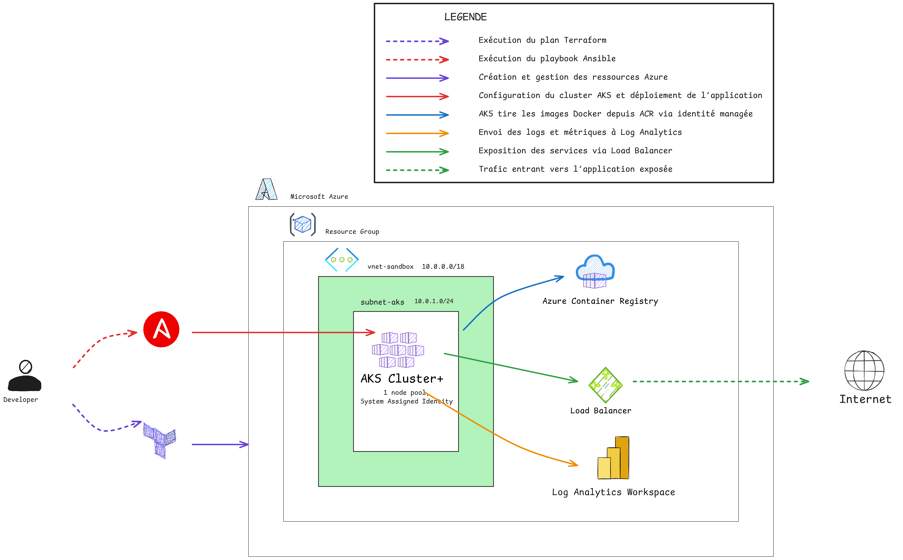

# Projet Azure Sandbox - Infrastructure Kubernetes avec Terraform & Ansible

Ce projet a pour objectif de concevoir, déployer et automatiser un environnement cloud sandbox sur Microsoft Azure, destiné à des usages d’apprentissage, de test et de démonstration d’outils DevOps.

---

## Architecture du Projet

L’infrastructure provisionnée comprend :

- Un **Groupe de ressources Azure**  
- Un **Réseau virtuel (VNet)** avec un sous-réseau dédié à AKS  
- Un **Cluster Azure Kubernetes Service (AKS)** avec identité managée  
- Un **Azure Container Registry (ACR)** pour stocker les images Docker  
- Un **Load Balancer** exposant l’application déployée  
- **Terraform** pour le provisioning automatique des ressources Azure  
- **Ansible** pour la configuration du cluster AKS et le déploiement d’une application NGINX   
- **Log Analytics** pour le monitoring du cluster  

Schéma  l’architecture 



---

## Structure du projet
  
~~~
ansible/
├── inventory.yaml                 # Inventaire Ansible
├── aks_deploy.yaml                # Playbook principal
└── roles/
    └── deploy_nginx/             
        ├── tasks/
        │   └── main.yaml          # Tâche Ansible
        └── files/
            ├── nginx-pod.yaml     # Manifest Kubernetes pour le Pod NGINX
            └── nginx-service.yaml # Manifest Kubernetes pour le Service LoadBalancer
doc/
├── architectures.png   # Schéma d’architecture
└── résultats/          # Captures des résultats
terraform/
├── main.tf             # Configuration principale des ressources Azure
├── variables.tf        # Définition des variables
├── outputs.tf          # Déclaration des sorties
└── providers.tf        # Configuration du provider Terraform (AzureRM)
~~~

---

## Prérequis

- **Azure CLI** (`az`)  
- **kubectl**  
- **Ansible** (avec collection `kubernetes.core`) 
- **Terraform** 
- Bibliothèque Python **kubernetes** installée 

---

## Déploiement

### Provisionnement avec Terraform

1. **Initialiser Terraform** 
   
Cela télécharge les plugins nécessaires et configure l'environnement de travail :  
```bash
terraform init
```

2. **Visualiser le plan de déploiement**

```bash
terraform plan
```

3. **Appliquer la configuration**
   
```bash
terraform apply
```

4. **Consulter les sorties**
   
```bash
terraform output
```

### Étape 2 : Configuration et déploiement avec Ansible

```bash
cd ../ansible
ansible-playbook -i inventory.yaml aks_deploy.yaml
```

---

## Vérification

### Résultat de l’exécution Ansible

Le playbook configure le cluster, crée le namespace sandbox, déploie le pod NGINX et expose le service via LoadBalancer.


### Accès Internet au service NGINX

Une fois le service déployé, l’IP publique est récupérée via la commande:
```bash
kubectl get svc nginx-service -n sandbox
```

Voici une capture du navigateur accédant au pod NGINX exposé :


Le service est accessible depuis Internet via l’IP publique du LoadBalancer.

---

## Nettoyage

Pour supprimer toutes les ressources créées, exécuter dans /terraform:
```bash
terraform destroy
```